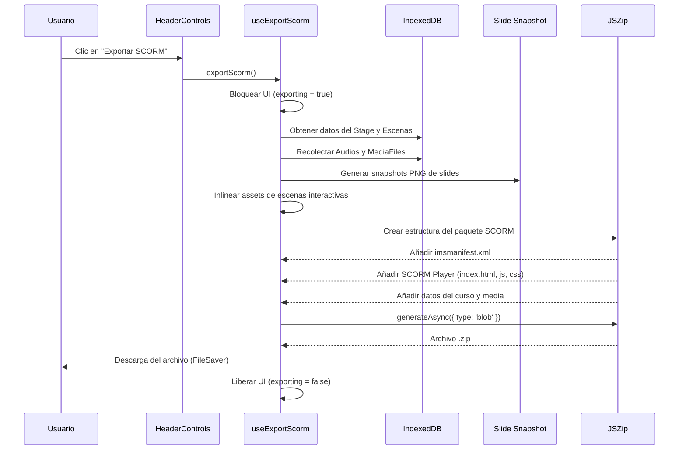

# Software Design Document (SDD): Exportación SCORM para OpenMAIC

## 1. Introducción

### 1.1 Propósito
El presente documento describe el diseño y la implementación de la nueva funcionalidad de "Exportación SCORM" para la plataforma OpenMAIC. El objetivo es permitir a los usuarios descargar el contenido completo de un curso (escenas de tipo slide, quiz, interactive y pbl) empaquetado bajo el estándar SCORM (Sharable Content Object Reference Model), de modo que pueda ser importado y reproducido en cualquier Sistema de Gestión de Aprendizaje (LMS) compatible.

### 1.2 Alcance
La funcionalidad se integrará en el menú de exportación existente de la aplicación (ubicado en `HeaderControls`), añadiendo una nueva opción junto a las exportaciones de PPTX, Paquete de Recursos y ZIP del Aula. La exportación generará un archivo `.zip` que contendrá:
- El manifiesto SCORM (`imsmanifest.xml`).
- Un reproductor HTML/JS embebido (Player SCORM) capaz de renderizar el contenido exportado.
- Todos los recursos multimedia (imágenes, audios, videos) y datos serializados del curso.

## 2. Arquitectura del Sistema

### 2.1 Componentes Principales
La solución se compone de tres módulos principales:

1. **Interfaz de Usuario (UI)**: 
   - Modificación del componente `HeaderControls` (`components/stage/header-controls.tsx`) para incluir el botón de exportación SCORM.
   - Actualización de los archivos de internacionalización (`lib/i18n/locales/*.json`) para soportar los nuevos textos.

2. **Lógica de Exportación (Client Hook)**:
   - Creación de un nuevo hook `useExportScorm` (en `lib/export/use-export-scorm.ts`), siguiendo el patrón de `useExportClassroom` y `useExportPPTX`.
   - Este hook se encargará de recopilar el estado del curso (`useStageStore`), inlinear assets, recolectar archivos multimedia desde IndexedDB y orquestar la creación del ZIP usando `jszip`.

3. **Generador SCORM (SCORM Builder & Player)**:
   - **Manifiesto SCORM**: Lógica para generar el archivo `imsmanifest.xml` requerido por el estándar (versión SCORM 1.2 o 2004, priorizando 1.2 por mayor compatibilidad).
   - **SCORM Player**: Un micro-reproductor web estático (HTML/JS/CSS) que se inyectará dentro del ZIP. Este reproductor leerá el manifiesto del curso exportado (similar a `manifest.json` del aula ZIP) y renderizará las escenas. Para las escenas tipo `slide`, utilizará imágenes pre-renderizadas (vía el snapshot del renderer de OpenMAIC) o una vista simplificada, y para `quiz` presentará las preguntas e interactuará con la API SCORM (`LMSInitialize`, `LMSSetValue`, `LMSCommit`, etc.) para reportar progreso y calificaciones al LMS.

### 2.2 Diagrama de Flujo



## 3. Diseño Detallado

### 3.1 Hook `useExportScorm`
El hook será responsable de la orquestación. Pasos clave:
1. Validar que el curso tenga escenas y no esté en proceso de generación.
2. Extraer `stage` y `scenes` de `useStageStore`.
3. Recolectar archivos multimedia utilizando las utilidades existentes en `classroom-zip-utils.ts` (`collectAudioFiles`, `collectMediaFiles`).
4. **Renderizado de Slides**: Para garantizar que las diapositivas se vean idénticas en cualquier LMS sin depender del motor de renderizado completo de OpenMAIC, se utilizará la función `slideToPng` (de `@openmaic/renderer/dist/snapshot`) para capturar cada escena tipo `slide` como una imagen PNG.
5. **Construcción del SCORM**:
   - Generar `imsmanifest.xml` definiendo la organización del curso.
   - Inyectar el código del reproductor SCORM.
6. Empaquetar todo en un ZIP y descargar.

### 3.2 SCORM Player
El reproductor SCORM incluido en el ZIP constará de:
- `index.html`: Punto de entrada que el LMS cargará en un iframe.
- `scorm-api.js`: Wrapper estándar para comunicarse con la API SCORM provista por el LMS (búsqueda de `API` o `API_1484_11` en los frames padres).
- `player.js`: Lógica de navegación (Anterior/Siguiente) y renderizado.
  - **Slides**: Muestra la imagen generada previamente.
  - **Quizzes**: Renderiza un formulario HTML basado en los datos de `QuizContent`, captura las respuestas, calcula el puntaje y llama a `LMSSetValue('cmi.core.score.raw', score)` y `LMSSetValue('cmi.core.lesson_status', 'completed')`.
  - **Interactive/PBL**: Muestra iframes o enlaces a los contenidos inlinados, marcando la escena como completada al visitarla.

### 3.3 Estructura del Paquete SCORM (.zip)
```
/
├── imsmanifest.xml           # Definición SCORM
├── index.html                # Reproductor SCORM (Entry point)
├── css/
│   └── player.css            # Estilos del reproductor
├── js/
│   ├── scorm-api.js          # Interfaz SCORM
│   └── player.js             # Lógica del reproductor
├── data/
│   └── course.json           # Datos estructurados del curso (manifiesto interno)
├── media/                    # Imágenes, videos, audios recolectados
└── slides/                   # Snapshots PNG de las diapositivas
```

## 4. Consideraciones de Implementación

- **Compatibilidad**: Se apuntará al estándar SCORM 1.2, ya que es el más universalmente soportado por los LMS modernos.
- **Rendimiento**: La generación de snapshots PNG para todas las diapositivas puede ser intensiva. Se implementará de forma asíncrona y secuencial para no bloquear el hilo principal, mostrando un `toast.loading` al usuario.
- **Internacionalización**: Se añadirán las claves `"scorm": "Exportar SCORM"` y `"scormDesc": "Paquete compatible con LMS"` a los archivos de idioma (ej. `es-ES.json`, `en-US.json`).

## 5. Plan de Ejecución
1. Modificar archivos de internacionalización (`locales`).
2. Crear el hook `use-export-scorm.ts` en `lib/export`.
3. Desarrollar las plantillas del SCORM Player (`index.html`, `imsmanifest.xml`, etc.) como strings o archivos estáticos a inyectar en el ZIP.
4. Integrar la opción en `HeaderControls`.
5. Realizar pruebas exportando un curso de prueba con slides y quiz, e importándolo en un validador SCORM (ej. SCORM Cloud).
